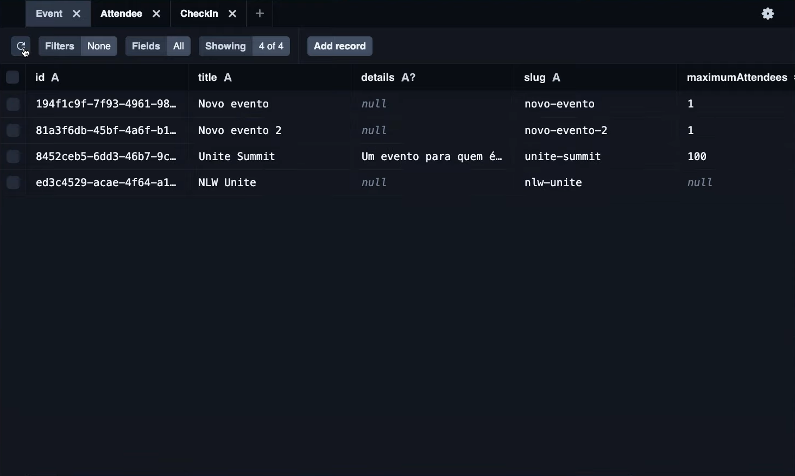

# Pass.in: Gestão de Participantes em Eventos Presenciais



O Pass.in é uma aplicação de **gestão de participantes em eventos presenciais**, desenvolvida em Node.js com Express e Prisma para o backend, e SQLite para o banco de dados. A ferramenta permite que o organizador cadastre um evento e abra uma página pública de inscrição. Os participantes inscritos podem emitir uma credencial para check-in no dia do evento, e o sistema fará um scan da credencial do participante para permitir a entrada no evento.

## 📝 Requisitos

### Requisitos Funcionais

- [x] O organizador deve poder cadastrar um novo evento;
- [x] O organizador deve poder visualizar dados de um evento;
- [x] O organizador deve poder visualizar a lista de participantes;
- [x] O participante deve poder se inscrever em um evento;
- [x] O participante deve poder visualizar seu crachá de inscrição;
- [x] O participante deve poder realizar check-in no evento;

### Regras de Negócio

- [x] O participante só pode se inscrever em um evento uma única vez;
- [x] O participante só pode se inscrever em eventos com vagas disponíveis;
- [x] O participante só pode realizar check-in em um evento uma única vez;

### Requisitos Não-Funcionais

- [x] O check-in no evento será realizado através de um QRCode;

## 📚 Documentação da API (Swagger)

Para documentação da API, acesse o link: [https://nlw-unite-nodejs.onrender.com/docs](https://nlw-unite-nodejs.onrender.com/docs)

## 🗄️ Banco de Dados

Nessa aplicação, utilizamos banco de dados relacional (SQL). Para ambiente de desenvolvimento, seguimos com o SQLite pela facilidade do ambiente.

### Diagrama ERD


### Estrutura do Banco (SQL)

```sql
-- CreateTable
CREATE TABLE "events" (
    "id" TEXT NOT NULL PRIMARY KEY,
    "title" TEXT NOT NULL,
    "details" TEXT,
    "slug" TEXT NOT NULL,
    "maximum_attendees" INTEGER
);

-- CreateTable
CREATE TABLE "attendees" (
    "id" INTEGER NOT NULL PRIMARY KEY AUTOINCREMENT,
    "name" TEXT NOT NULL,
    "email" TEXT NOT NULL,
    "event_id" TEXT NOT NULL,
    "created_at" DATETIME NOT NULL DEFAULT CURRENT_TIMESTAMP,
    CONSTRAINT "attendees_event_id_fkey" FOREIGN KEY ("event_id") REFERENCES "events" ("id") ON DELETE RESTRICT ON UPDATE CASCADE
);

-- CreateTable
CREATE TABLE "check_ins" (
    "id" INTEGER NOT NULL PRIMARY KEY AUTOINCREMENT,
    "created_at" DATETIME NOT NULL DEFAULT CURRENT_TIMESTAMP,
    "attendeeId" INTEGER NOT NULL,
    CONSTRAINT "check_ins_attendeeId_fkey" FOREIGN KEY ("attendeeId") REFERENCES "attendees" ("id") ON DELETE RESTRICT ON UPDATE CASCADE
);

-- CreateIndex
CREATE UNIQUE INDEX "events_slug_key" ON "events"("slug");

-- CreateIndex
CREATE UNIQUE INDEX "attendees_event_id_email_key" ON "attendees"("event_id", "email");

-- CreateIndex
CREATE UNIQUE INDEX "check_ins_attendeeId_key" ON "check_ins"("attendeeId");
```

## 🚀 Para Rodar o Backend do Projeto, Siga as Instruções Abaixo

### Instalação das Dependências

Primeiro, você precisa instalar todas as dependências necessárias para o projeto. Para isso, execute o seguinte comando no terminal:

```bash
npm i
```

### Seed do Banco de Dados

Após a instalação das dependências, é necessário popular o banco de dados com os dados iniciais. Isso pode ser feito utilizando o Prisma para executar o comando de seed. Execute o seguinte comando no terminal:

```bash
npx prisma db seed
```

### Execução do Projeto

Por fim, para iniciar o servidor de desenvolvimento e começar a utilizar o backend do projeto, execute o comando:

```bash
npm run dev
```

Este comando iniciará o servidor em modo de desenvolvimento, permitindo que você faça alterações no código e veja as mudanças em tempo real sem precisar reiniciar o servidor manualmente.

**Lembre-se:**

- Você precisa ter o Node.js instalados em sua máquina.
- Certifique-se de estar na pasta raiz do projeto antes de executar os comandos.

## 🌐 Versão Web

Para a versão web do Pass.in, que permite aos participantes se inscreverem e realizarem check-in através de uma interface amigável, acesse o repositório: [Pass.in Web API](https://github.com/eduardosichelero/Nlw_Unite_Pass_in_web_api)

### 🔗 Integração

A integração entre a versão web e o backend é feita através de requisições HTTP, utilizando a API RESTful desenvolvida com Express. A versão web consome os endpoints da API para realizar as operações de inscrição, visualização de crachá, e check-in.

- **Inscrição**: A versão web envia uma requisição POST para o endpoint de inscrição, incluindo os dados do participante no corpo da requisição.
- **Visualização de Crachá**: A versão web envia uma requisição GET para o endpoint de visualização de crachá, utilizando o ID do participante como parâmetro.
- **Check-in**: A versão web envia uma requisição POST para o endpoint de check-in, incluindo o ID do participante no corpo da requisição.

Essa integração permite que os participantes interajam com o sistema de forma intuitiva, sem a necessidade de lidar diretamente com a API.
